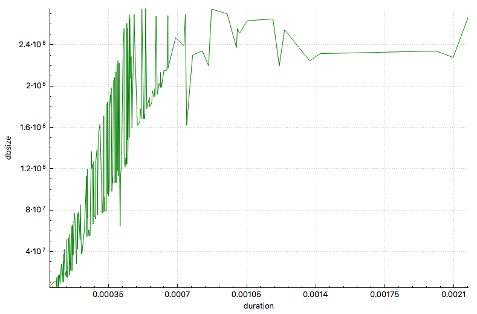

# Problem 5 : Database Performance

This challenge is about database performance. We're asked to repeatedly:
1. add a large image file to the database
2. then perform a full text search.
3. time the operation and record the results

This should indicate the relationship between performance and the size of the database.

The dataset we are using is the NASA “[Astronomy Picture of the Day](https://api.nasa.gov/api.html#Apod)” (APOD).
Accessing the data requires a [NASA authentication key](https://api.nasa.gov/index.html#apply-for-an-api-key). The actual URL to APOD is [here](https://api.nasa.gov/planetary/apod?api_key=KEY&date=YYYY-MM-DD).

The High Definition image is located in ‘hdurl’. Occasionally, hdurl is omitted, which can mean the URL points to a youtube video or other graphic. If hdurl is missing, ignore that listing and move on to the next. Don’t forget to increment any counters you might be using to keep track of the 200 listings.

Your code should:
1. Access the most recent APODs by date. Start with today, then move back approximately 200 days, one day at a time.
2. Ignore dates that have no image or list a video instead of an image. If hdurl is missing from APOD json, get a new json line.
3. Create fields in your database for date, explanation, title and HDimage. Store appropriate metadata information in each
4. Store the hdurl image in the database as a blob (or whatever datatype is appropriate)
5. Start a timer
6. Search database.explanation for the word “Solar” (the number of hits doesn’t matter - we’re only interested in the time it takes.)
7. Stop the timer
8. Calculate the size of the database
9. In a separate table, record the size of the database compared to the time to complete the search

Do this for 200 rows in the database.

Lastly, create a chart showing time across the horizontal axis and database size across the y-axis. This can be done by hand if need be, but you’ll at least need to export the data to some plotting tool.

Here's my result:

